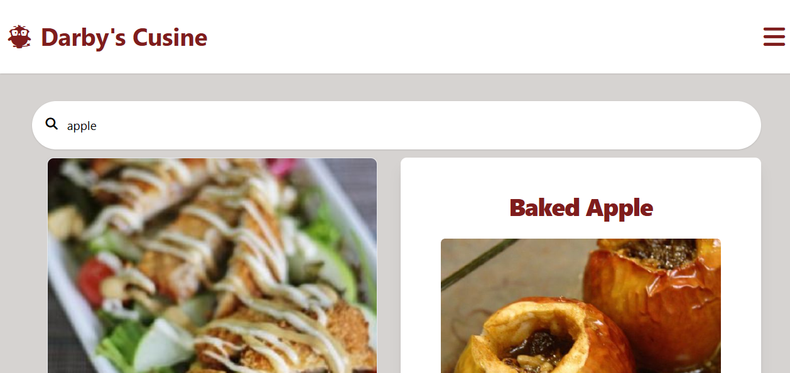
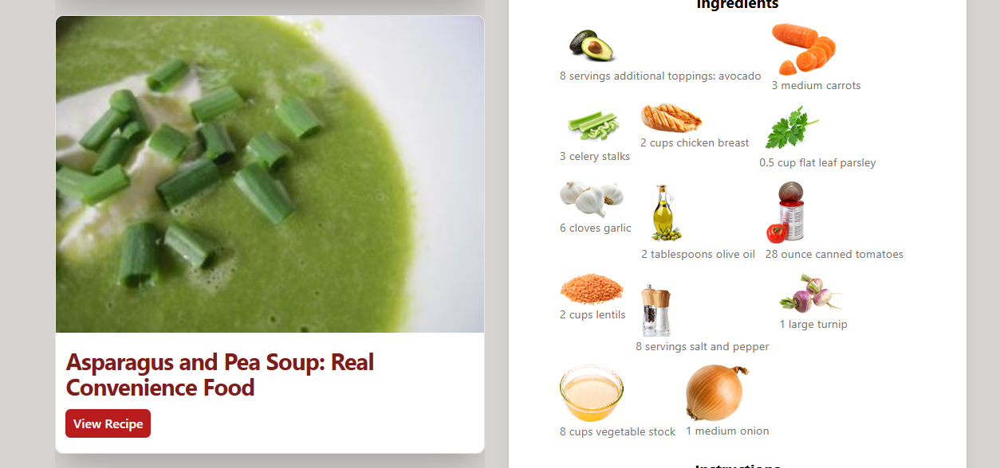
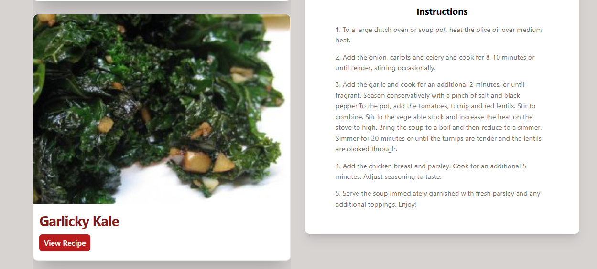
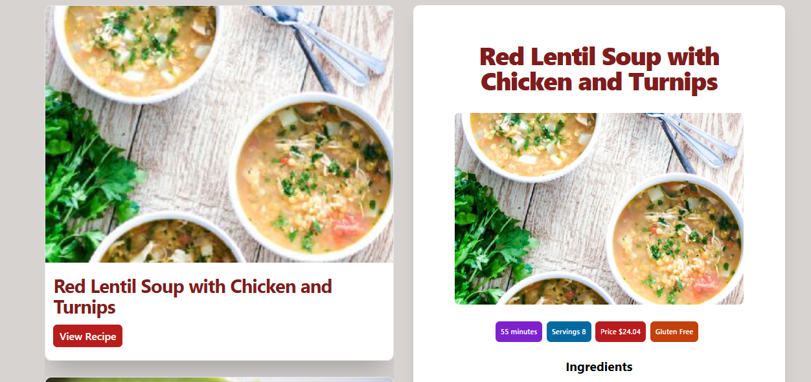
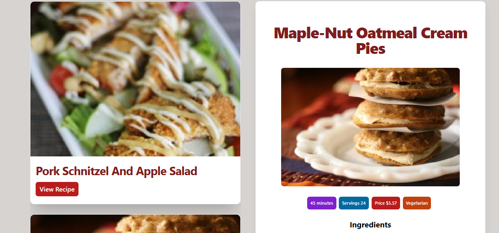

# 🎉 Culinary Compass

## 🏷️ Demo
https://github.com/user-attachments/assets/8a00e222-50fc-4d17-8e2e-5a1b44d3457c
  
  
  
  
  

## 📜 Description

Culinary Compass is a **React application** that fetches and displays recipes from the **Spoonacular API**. This application serves as your **culinary companion**, allowing users to explore a wide variety of recipes based on ingredients, dietary preferences, and meal types. It aims to simplify meal planning and inspire home cooks by providing easy access to delicious recipes.

With a focus on **user-friendly design** and **real-time data fetching**, this application enhances the cooking experience by offering detailed recipe information, including ingredients, cooking instructions, and nutritional facts.

## 🌟 Features

- **Recipe Search**: Users can search for recipes based on ingredients or keywords. 🔍
- **Detailed Recipe View**: Each recipe includes ingredients, instructions, and nutritional information. 📜
- **Favorites Functionality**: Users can save their favorite recipes for easy access later. ❤️
- **Responsive Design**: The application is designed to work seamlessly on both desktop and mobile devices. 📱💻
- **User-Friendly Interface**: A clean and intuitive UI that enhances the user experience. 🎨
- **Real-Time API Integration**: Fetches data from the Spoonacular API to provide up-to-date recipe information. ⚡

## 🛠️ Technologies Used

This project is built using a modern web development stack:

- **Frontend Framework**: **ReactJS** for building the user interface. 🔗
- **Styling**: **Tailwind CSS** for fast, responsive styling. 🎨
- **State Management**: **React Context API** for managing global state. 📦
- **API Integration**: Utilizes HTTP requests to the Spoonacular API. 🌐
- **Development Environment**: **Vite** for fast development and optimized builds. ⚙️

## 📥 Installation Instructions

Follow these steps to set up the project locally on your machine.

**Prerequisites**

Make sure you have the following installed on your machine:

- [Git](https://git-scm.com/)
- [Node.js](https://nodejs.org/en)
- [npm](https://www.npmjs.com/) (Node Package Manager)

## ⚠️ API Usage Notes

- Free Spoonacular plan limits daily requests; handle **429 errors** gracefully.
- Never expose your API key in public repositories.

## 🙏 Acknowledgments

Thanks to **Spoonacular** for the rich recipe data and to the **Code Stoic** community for React inspiration.
